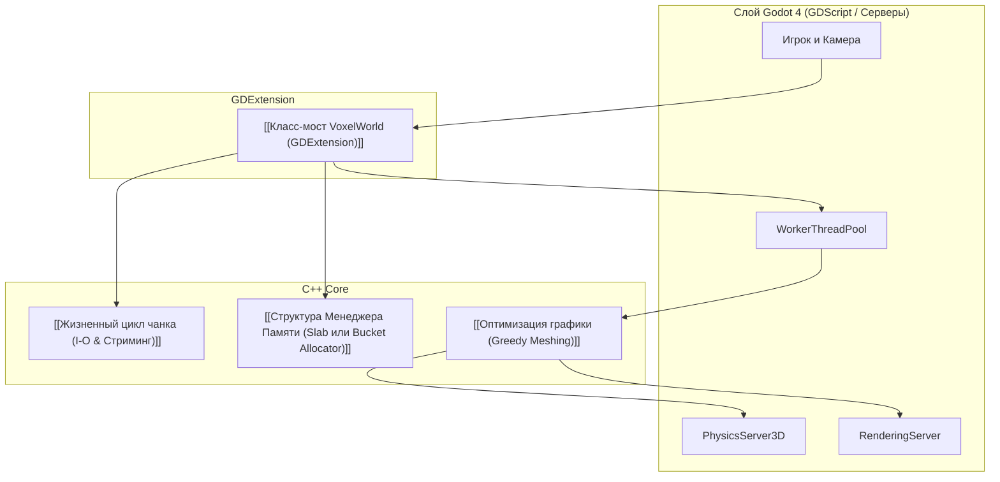

Разделение обязанностей между C++ (GDExtension) и игровым движком Godot 4 для достижения максимального FPS.

---

---
## Распределение задач
* **C++ (GDExtension)**: [[Структура Менеджера Памяти (Slab или Bucket Allocator)|Управление пулами памяти]], битовые сдвиги, [[Оптимизация графики (Greedy Meshing)|Генерация полигональных сеток (Greedy Meshing)]], расчет шумов.
* **Godot 4**: Вывод графики (`RenderingServer`), просчет коллизий (`PhysicsServer3D / Jolt`), менеджмент потоков (`WorkerThreadPool`), UI и логика игрока.
