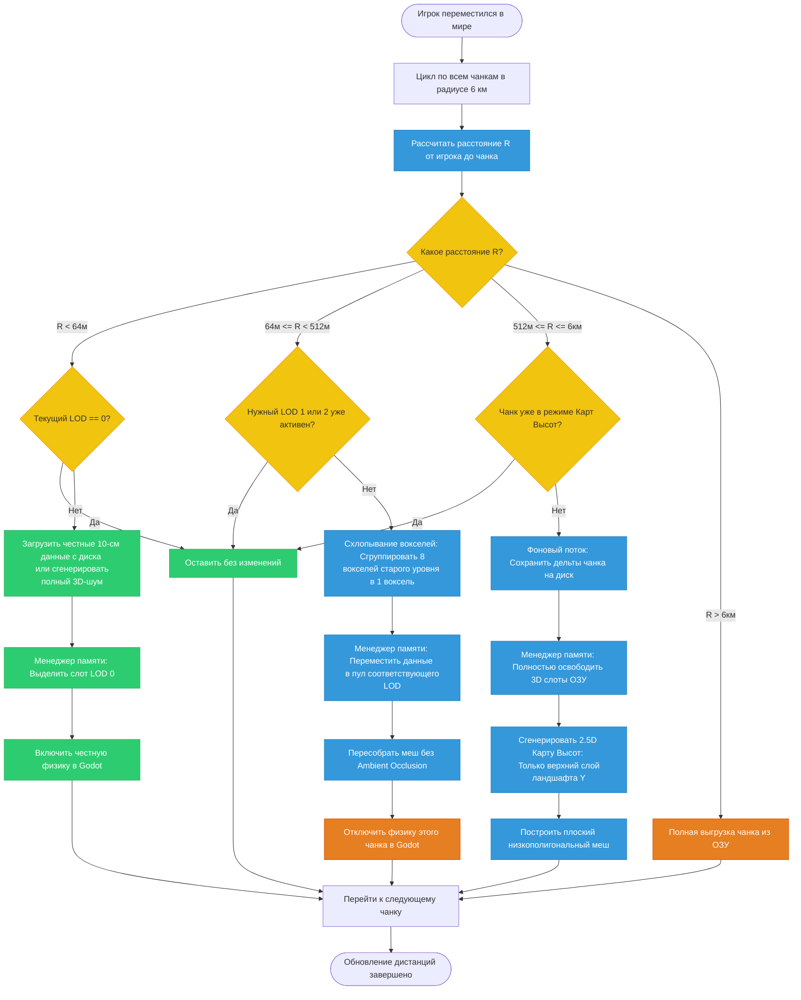

Обеспечивает дальность прорисовки от 1 до 6 км для вокселей размером 10 см без перегрузки ОЗУ и видеокарты.

---
## Концепция MIP-картирования вокселей

По мере удаления от игрока чанки проходят через процедуру **даунсемплинга (downsampling)** — каждые 8 вокселей (2 × 2 × 2) физически схлопываются в 1 воксель большего размера. При этом внутреннее устройство чанка в памяти остается неизменным (все те же 32³ вокселей), но его физический размер в метрах увеличивается вдвое на каждый уровень LOD.

| Уровень LOD      | Размер вокселя | Физический размер чанка | Дистанция от игрока | Зона применения                           |
| ---------------- | -------------- | ----------------------- | ------------------- | ----------------------------------------- |
| **LOD 0**        | 10 см          | 3.2 × 3.2 × 3.2 м       | 0 – 64 метров       | Честный 3D мир (Разрушаемость, физика)    |
| **LOD 1**        | 20 см          | 6.4 × 6.4 × 6.4 м       | 64 – 256 метров     | Упрощенный 3D мир (Крупная разрушаемость) |
| **LOD 2**        | 40 см          | 12.8 × 12.8 × 12.8 м    | 256 – 512 метров    | Только визуал, физика отключена           |
| **LOD 3 (2.5D)** | —              | Поверхность ландшафта   | 512 – 6000 метров   | Горизонт (Карта высот, плоский меш)       |

---
## Конвейер Стриминга и Оптимизации Дистанции (LOD Manager)

---
## Оптимизация памяти

При удалении чанка в зону > 512 метров, его честные 3D-данные выгружаются из [[Структура Менеджера Памяти (Slab или Bucket Allocator)|Slab-алокатора]], а на его месте генерируется плоский меш ландшафта на основе двумерной карты высот (Heightmap), занимающей всего 1024 байта на чанк.

*Связанные заметки:* [[Жизненный цикл чанка (I-O & Стриминг)]], [[Класс-мост VoxelWorld (GDExtension)]].

---
## Архитектурные правила для реализации (ТЗ)

1. **Бесшовный переход (Pop-in Mitigation)**:  
    При резком переключении меша с LOD 1 на LOD 0 игрок может заметить «мигание» геометрии. В Godot-шейдере для дальних LOD рекомендуется использовать простое попиксельное смешивание (Dither Fade), чтобы геометрия плавно растворялась при смене детализации.
2. **Асинхронный даунсемплинг**:  
    Схлопывание битовых массивов (из LOD 0 в LOD 1) — это чисто математическая операция над массивом `uint64_t`. Она должна выполняться исключительно в `WorkerThreadPool` Godot, чтобы не вызывать фризов экрана во время движения.
3. **Глобальный хейтмап мира**:  
    Для дистанций от 512 м до 6 км данные высот ландшафта хранятся в виде двумерного массива `uint8_t` или `uint16_t` (карта высот Y для каждой координаты X, Z). Один чанк в режиме карты высот занимает всего **1024 байта** (вместо мегабайтов честного 3D), что позволяет легко держать в памяти весь горизонт в радиусе 6 км.

---
*Связанные заметки:* [[Жизненный цикл чанка (I-O & Стриминг)]], [[Класс-мост VoxelWorld (GDExtension)]].