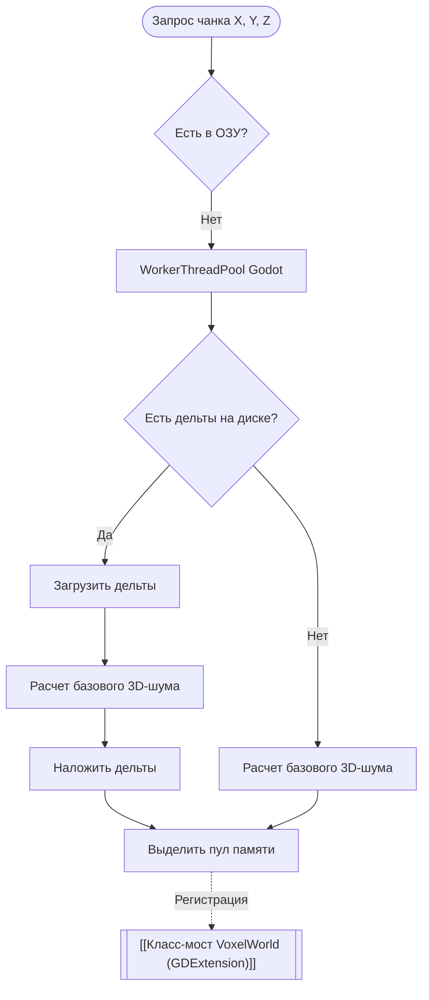

Управляет асинхронной загрузкой, процедурной генерацией и выгрузкой воксельной геометрии вокруг игрока.

---

- **Оптимизация сохранения (Delta Storage)**: На диск сохраняются **только изменения (дельты)**, внесенные игроком или физикой. Неизмененный ландшафт генерируется заново из шума. Данные перед записью сжимаются через **LZ4 / ZSTD**.
- **Флаг модификации (Dirty Flag)**: Чанк сериализуется на диск при выгрузке только в том случае, если у него стоит флаг `is_dirty == true`.

---
## Схема стриминга

---
## Правила выгрузки
При выгрузке чанка проверяется флаг модификации. Если чанк был изменен, вызывается [[Сохранение изменений ландшафта (Delta Storage)]]. Если изменений не было, слот пула очищается без обращений к диску.

---
*Связанные заметки:* [[Дальний горизонт мира (LOD & Heightmaps)]], [[Класс-мост VoxelWorld (GDExtension)]].
