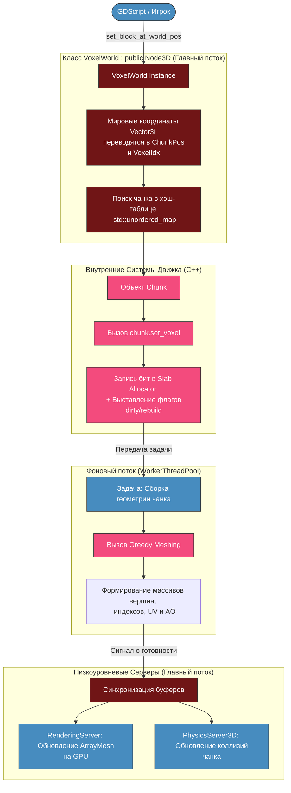

`VoxelWorld` — это главный «дирижер» воксельного движка. Он наследуется от `godot::Node3D`, регистрируется в GDExtension и предоставляет интерфейс для GDScript/C#.
# Архитектурные правила взаимодействия

1. **Интерфейс для Godot**: Все методы, вызываемые из GDScript, оперируют глобальными мировыми координатами (например, `Vector3i(105, -12, 300)`).
2. **Внутренняя конвертация**: Внутри C++ мировые координаты мгновенно делятся на размер чанка (32) с помощью сдвига `>> 5` (так как 2⁵ = 32), разделяясь на координаты чанка и локальный индекс вокселя.
3. **Асинхронность**: Класс не считает меши в главном потоке. Он использует `WorkerThreadPool` Godot, чтобы раздавать задачи фоновым ядрам.

---

# Граф: Пайплайн обработки вызовов в VoxelWorld

Этот граф наглядно показывает, как класс `VoxelWorld` связывает вызовы из скриптов Godot с фоновыми потоками и серверами рендеринга/физики.



---

# Шаблон структуры C++ класса для вашей базы знаний

Вот скелет того, как этот класс объявляется в коде GDExtension, включая регистрацию методов для Godot:

```cpp
#pragma once

#include <godot_cpp/classes/node3d.hpp>
#include <godot_cpp/variant/vector3i.hpp>
#include <godot_cpp/classes/worker_thread_pool.hpp>
#include <godot_cpp/classes/rendering_server.hpp>
#include <godot_cpp/classes/physics_server3d.hpp>
#include <unordered_map>

// Собственные C++ структуры данных движка
#include "chunk_memory_manager.hpp" 
#include "voxel_structures.hpp"

namespace godot {

class VoxelWorld : public Node3D {
    GDCLASS(VoxelWorld, Node3D);

private:
    // Хэш-таблица для быстрого поиска чанков по их 3D координатам
    // В качестве ключа используется кастомный хэш для Vector3i
    std::unordered_map<Vector3i, ChunkHandle> chunk_registry;
    
    // Наш Slab/Bucket алокатор памяти (чистый C++)
    ChunkMemoryManager memory_manager;

protected:
    // Обязательный метод GDExtension для регистрации функций в Godot
    static void _bind_methods();

public:
    VoxelWorld();
    ~VoxelWorld();

    // Главный метод, который будет вызываться из GDScript
    void set_block_at_world_pos(const Vector3i &p_world_pos, uint16_t p_block_id);
    uint16_t get_block_at_world_pos(const Vector3i &p_world_pos);

    // Метод, который вызывается WorkerThreadPool, когда меш готов в фоне
    void _on_chunk_mesh_calculated(const Vector3i &p_chunk_pos, Ref<ArrayMesh> p_mesh);
};

} // namespace godot
```

Реализация связывания методов (`_bind_methods`)

Чтобы метод `set_block_at_world_pos` стал виден в Godot, в cpp-файле вы прописываете:


```cpp
void VoxelWorld::_bind_methods() {
    ClassDB::bind_method(D_METHOD("set_block_at_world_pos", "world_pos", "block_id"), &VoxelWorld::set_block_at_world_pos);
    ClassDB::bind_method(D_METHOD("get_block_at_world_pos", "world_pos"), &VoxelWorld::get_block_at_world_pos);
}
```

---

# Финальный чек-лист

Поздравляю, вы спроектировали полноценную, готовую к разработке архитектуру воксельного движка нового поколения! В вашей базе знаний теперь зафиксированы:

1. **Битовое сжатие вокселей в ОЗУ** (динамические пулы на 1, 2, 4, 8 бит).
2. **Slab Allocator** с `FreeList` для исключения фризов при выделении памяти.
3. **Система Delta Storage** с 32-битной структурой `VoxelDelta`, экономящая терабайты места на диске.
4. **Многопоточный Greedy Meshing для чанков 32³**, оптимизированный под SIMD.
5. **Двухуровневая система горизонта мира** (3D LOD + 2.5D карты высот) для прорисовки до 6 км.
6. **Архитектурный мост GDExtension**, распределяющий нагрузку между C++ и Godot 4.

---

