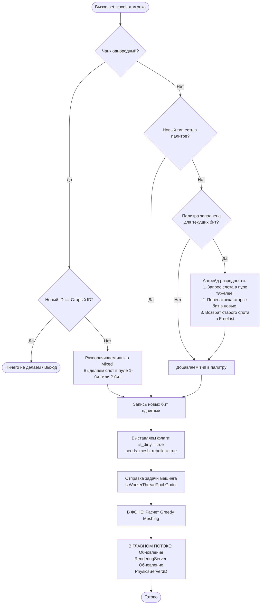

Алгоритм мутации данных чанка при изменении вокселя игроком или физикой.

---

При вызове `voxel_world.set_block(x, y, z, block_id)` со стороны GDScript происходит следующая цепочка:

1. **Проверка**: 
	Если чанк однородный и новый `block_id` совпадает со старым → мгновенный выход.
2. **Апгрейд (если нужен)**: 
	Если чанк однородный или количество бит не вмещает новый тип → запрашивается слот в более тяжелом пуле памяти. Старые биты перепаковываются в новый слот. Старый слот возвращается в свой `FreeList`.
3. **Запись**: 
	Выполняется сдвиг `(mixed.packed_voxels[array_idx] >> bit_offset) & base_mask` для обновления бит (или сброс маской старых бит и наложение новых через `|`).
4. **События**: 
	Flag `is_dirty = true`, flag `needs_mesh_rebuild = true`.
5. **Потоки**: 
	Задача на пересчет геометрии уходит в `WorkerThreadPool`. После готовности меша в главном потоке обновляются `RenderingServer` и `PhysicsServer3D`.

---
## Реализация сдвигов
Используется логика сдвига 64-битного слова вправо на `bit_offset` с последующим наложением маленькой константной маски (например, `0x03` для 2 бит), что эффективнее динамических масок.

---
*Связанные заметки:* [[Принципы управления памятью (Chunk Memory)]], [[Структура Менеджера Памяти (Slab или Bucket Allocator)]], [[Класс-мост VoxelWorld (GDExtension)]].
