Алгоритм объединения («склеивания») соседних одинаковых граней вокселей в большие прямоугольники (квады) для минимизации Draw Calls на GPU.
## Зачем это нужно?

Если отрисовывать каждый воксель как отдельный куб из 12 треугольников, видеокарта мгновенно «задохнется» от миллиардов полигонов.

1. **Простой мешинг (Cull Face)**: Удаляет только те грани кубов, которые невидимы (скрыты под соседними непрозрачными блоками).
2. **Жадный мешинг (Greedy Meshing)**: Идет гораздо дальше. Он сканирует плоскости чанка и **объединяет («склеивает») соседние грани одинаковых блоков в один большой прямоугольник**. Вместо сотен мелких полигонов видеокарта рисует всего один большой прямоугольник, что поднимает FPS в разы.

---
## Конвейер для чанка 32³

```mermaid
flowchart TD
    Start([Запуск Greedy Meshing для Чанка 32³]) --> LoopAxis[Цикл по осям: X, Y, Z]
    
    LoopAxis --> LoopSlice[Цикл по срезам выбранной оси <br> от 0 до 31]
    
    %% Двумерный проход по срезу
    LoopSlice --> CreateMask[Создать 2D-маску среза <br> размер 32×32]
    CreateMask --> FillMask[Заполнить маску: <br> Записать типы блоков и направления видимых граней]
    
    %% Обход маски
    FillMask --> LoopY[Цикл по строкам маски v от 0 до 31]
    LoopY --> LoopX[Цикл по столбцам маски u от 0 до 31]
    
    LoopX --> CheckMask{"В ячейке (u, v) есть <br> нескомпилированная грань?"}
    
    %% Нашли грань — начинаем жадное расширение
    CheckMask -- Да --> WidthExpansion[Расширение в ширину: <br> Двигаемся по строке вправо до упора, <br> пока блоки равны. Находим Ширину W <= 32]
    WidthExpansion --> HeightExpansion[Расширение в высоту: <br> Двигаемся по строкам вверх целым рядом W, <br> пока условия верны. Находим Высоту H <= 32]
    
    HeightExpansion --> CreateQuad[Создать Квад: <br> Прямоугольник размером W × H]
    CreateQuad --> TextureCalc[Рассчитать UV-координаты <br> с учетом 10-см шага вокселей]
    TextureCalc --> AO_Calc[Расчет Ambient Occlusion: <br> Проверить угловых соседей для создания мягких теней]
    
    AO_Calc --> PushMesh[Записать 4 вершины и 6 индексов <br> в буфер меша C++]
    PushMesh --> MarkVisited[Пометить ячейки прямоугольника <br> W × H в маске как посещенные]
    MarkVisited --> NextX
    
    %% Ячейка пуста или уже обработана
    CheckMask -- Нет --> NextX[Следующий столбец u++]
    
    NextX --> EndX{u == 32?}
    EndX -- Нет --> LoopX
    EndX -- Да --> NextY[Следующая строка v++]
    
    NextY --> EndY{v == 32?}
    EndY -- Нет --> LoopY
    
    %% Завершение срезов и осей
    EndY -- Да --> EndSlice{Все 32 среза оси пройдены?}
    EndSlice -- Нет --> LoopSlice
    EndSlice -- Да --> EndAxis{Все 3 оси пройдены?}
    
    EndAxis -- Нет --> LoopAxis
    EndAxis -- Да --> FinalizeBuffers[Передать массивы вершин, индексов, <br> UV и AO в Godot ArrayMesh]
    FinalizeBuffers --> End([Меш 32³ успешно построен])

    %% Стилизация
    classDef loop fill:#34495e,stroke:#2c3e50,stroke-width:1px,color:#fff;
    classDef process fill:#3498db,stroke:#2980b9,stroke-width:1px,color:#fff;
    classDef decision fill:#f1c40f,stroke:#f39c12,stroke-width:1px,color:#333;
    classDef godot fill:#478cbf,stroke:#333,stroke-width:1px,color:#fff;
    
    class LoopAxis,LoopSlice,LoopY,LoopX loop;
    class CreateMask,FillMask,WidthExpansion,HeightExpansion,CreateQuad,TextureCalc,AO_Calc,PushMesh,MarkVisited process;
    class CheckMask,EndX,EndY,EndSlice,EndAxis decision;
    class FinalizeBuffers godot;

```

---
## Важные нюансы:

1. **Текстурирование (Texture Bleeding & Tiling)**:  
	Когда вы растягиваете один прямоугольник на 10 блоков в ширину, обычная текстура просто растянется и размоется. Чтобы этого не происходило, в Godot-шейдере используется режим повторения текстуры (`FRAGCOORD` или кастомный расчет UV на основе мировых координат вокселя).
2. **Мягкие тени в углах (Ambient Occlusion)**:  
    Прямо в процессе «жадного» слияния граней (блок `AO_Calc`), алгоритм проверяет наличие соседних блоков вокруг прямоугольника. Если рядом есть стена, вершинам меша присваивается пониженная яркость (цвет затеняется). Это создает красивый эффект мягких теней в углах комнат и пещер без использования тяжелого динамического освещения.
3. **Прозрачность (Transparency Split)**:  
    Алгоритм Greedy Meshing должен запускаться отдельно для **непрозрачных** блоков (камень, земля) и **полупрозрачных/прозрачных** (вода, стекло). Прозрачные меши должны рендериться Godot'ом в отдельном проходе, иначе возникнут баги с невидимостью блоков сквозь воду.
4. **SIMD Оптимизация**
	Размер маски среза составляет $32 \times 32 = 1024$ бита. Проход по строке маски (32 вокселя) оптимизируется компилятором через **AVX2 / SSE4.2**, позволяя анализировать целые строки за одну инструкцию процессора.
---
*Связанные заметки:* [[Класс-мост VoxelWorld (GDExtension)]], [[Архитектурная карта систем (Взаимодействие С++ и Godot 4)]].
