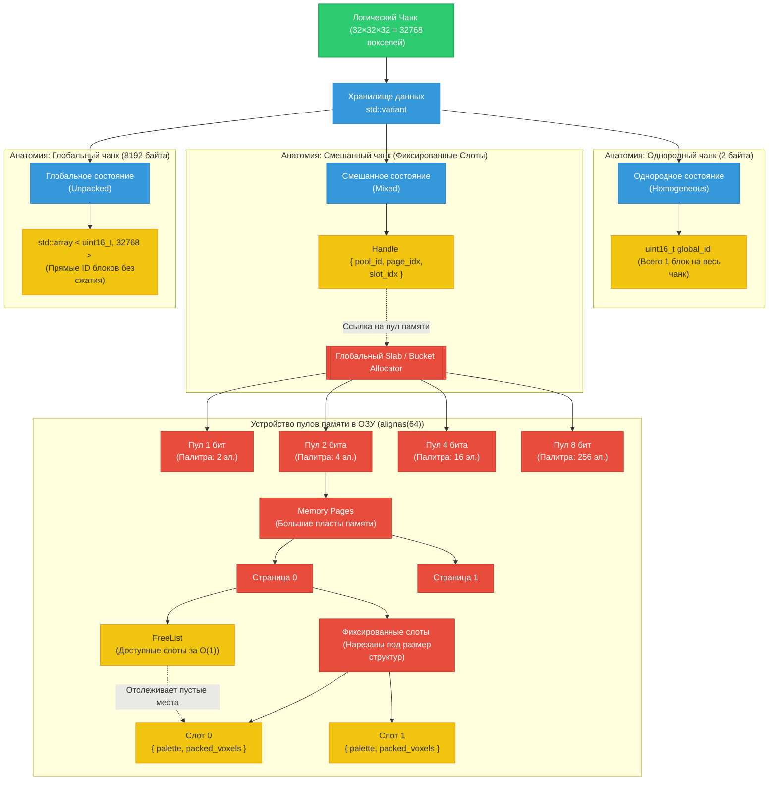

Определяет, как воксельные данные хранятся в оперативной памяти с максимальной локальностью кэша процессора.

---
## Способы хранения (Bit-Packing)
Данные чанка размером 32³ (32 768 вокселей) хранятся внутри `std::variant`:
1. **Однородное состояние**: Хранит только `uint16_t global_id`. Расход: 2 байта.
2. **Смешанное состояние**: Хранит [[Структура Менеджера Памяти (Slab или Bucket Allocator)|Handle на слот в Slab-алокаторе]]. Разрядность динамическая: 1, 2, 4 или 8 бит. Использует [[Принципы управления памятью (Chunk Memory)#Система палитр|Локальную палитру]].
3. **Глобальное состояние**: Плоский массив `std::array<uint16_t, 32768>` для чанков, где уникальных блоков > 256.

---
## Система палитр
Размеры палитр жестко привязаны к разрядности бит:
* 1 бит -> `std::array<uint16_t, 2>`
* 2 бита -> `std::array<uint16_t, 4>`
* 4 бита -> `std::array<uint16_t, 16>`
* 8 бит -> `std::array<uint16_t, 256>`

---

## Алокатор страниц (Slab / Bucket Allocator)

- Внутри чанков **запрещено** использовать `std::vector` или вызовы `new/malloc` для динамических массивов.
- Память выделяется глобальным менеджером большими страницами (`Memory Pages`).
- Каждая страница нарезана на **фиксированные слоты** под конкретную разрядность (бакеты: пул для 2-битных, пул для 4-битных чанков).
- Размеры палитр жестко привязаны к разрядности для сохранения фиксированного размера слота:
    - 1 бит → Палитра из 2 элементов (`std::array<uint16_t, 2>`)
    - 2 бита → Палитра из 4 элементов (`std::array<uint16_t, 4>`)
    - 4 бита → Палитра из 16 элементов (`std::array<uint16_t, 16>`)
    - 8 бит → Палитра из 256 элементов (`std::array<uint16_t, 256>`)
- Все структуры слотов должны быть выровнены по кэш-линии процессора (`alignas(64)`).

---
## Дескрипторы (Handles)

- Объекты чанков в игровой логике не имеют права хранить сырые указатели на свои битовые данные.
- Чанк хранит легковесный **Handle** (индекс страницы + индекс слота).
- Поиск свободных слотов в страницах при выделении или апгрейде разрядности чанка происходит за O(1) через **FreeList** (структура, отслеживающая пустые индексы).

---

## Как читать этот граф в контексте кода:

1. **Переключение состояний**: Когда в чанк добавляются новые блоки, логика переключает `std::variant`. При переходе в состояние `Mixed`, чанк перестает хранить данные «в себе» и перенаправляет запрос на `Handle`.
2. **Локальность кэша (`alignas(64)`)**: Все данные в красной зоне (`Slab Allocator`) лежат в памяти монолитными, последовательными блоками, выровненными по длине кэш-линии процессора. Процессор считывает `Slot 1` моментально, без лишних «прыжков» по куче.
3. **Безопасность (`Handle`)**: Желтый блок `Handle` содержит лишь индексы. Если страница памяти `Page 0` будет перемещена или оптимизирована менеджером, логический чанк не сломается, так как он не зависит от физических сырых указателей C++.

---

*Связанные заметки:* [[Конвейер Изменения Вокселя (set_voxel) с изменением разрядности]], [[Класс-мост VoxelWorld (GDExtension)]].