Концепция сохранения **только разницы (дельт)** между процедурным шумом генератора и действиями игрока, что экономит гигабайты дискового пространства.

---
## Проблема «сырого» сохранения

Если записывать чанк 32³ целиком на диск, то даже в сжатом виде (допустим, 4 КБ на чанк), мир размером всего 1000 × 1000 блоков при сохранении будет весить десятки гигабайт. При этом 99% этих данных — это просто камень, земля и воздух, которые генератор шума и так идеально воссоздает по сиду мира.

## Решение (Дельты изменений)

Мы сохраняем на диск **только разницу** между тем, что создал генератор, и тем, что сделал игрок (сломал, поставил, взорвал).

- Если игрок не трогал чанк — на диск под этот чанк пишется **0 байт**.
- Если игрок сломал 5 блоков, на диск пишется массив из 5 элементов.

---
## Структура Delta-пакета (4 байта)

```cpp
struct alignas(4) VoxelDelta {
    uint32_t voxel_index : 15; // Позиция в чанке 32³ (0..32767)
    uint32_t global_id   : 16; // Глобальный ID блока (0..65535)
    uint32_t reserved    : 1;  // Запасной бит (флаг света / метаданных)
};
```

---

## Конвейер работы с дельтами (Delta Storage Pipeline)

```mermaid
flowchart TD
    %% Сегмент загрузки
    subgraph Loading_Pipeline ["Конвейер Загрузки (Фоновый поток)"]
        StartLoad([Запрос чанка X, Y, Z]) --> CallGenerator[Генератор: Создать базовый массив вокселей из 3D-шума]
        CallGenerator --> ReadDB{Есть запись дельт <br> для этих координат на диске?}
        
        %% Чистый чанк
        ReadDB -- Нет --> CleanChunk[Использовать чистый шум ландшафта] --> SendToMemory
        
        %% Чанк с изменениями
        ReadDB -- Да --> LoadBytes[Прочитать сжатый бинарный блок]
        LoadBytes --> Decompress[Распаковка потока <br> через LZ4 / ZSTD]
        Decompress --> ParseDeltas["Распарсить массив структур <br> VoxelDelta { index, global_id }"]
        
        ParseDeltas --> LoopDeltas[Цикл по всем дельтам в пакете]
        LoopDeltas --> Overwrite[Записать global_id в базовый массив <br> по указанному index]
        Overwrite --> EndLoop{Все дельты наложены?}
        EndLoop -- Нет --> LoopDeltas
        EndLoop -- Да --> SendToMemory[Передать готовый массив вокселей <br> в Менеджер памяти чанков]
    end

    %% Сегмент сохранения
    subgraph Saving_Pipeline ["Конвейер Сохранения (Фоновый поток)"]
        StartSave([Выгрузка измененного чанка]) --> CheckDirty{is_dirty == true?}
        
        CheckDirty -- Нет --> FreeSlot[Просто освободить слот в ОЗУ] --> EndSave([Готово])
        
        CheckDirty -- Да --> RegeneBase[Генератор: Быстро воссоздать <br> базовый шум этого чанка во временный буфер]
        RegeneBase --> CompareArrays[Сравнить текущий чанк из ОЗУ <br> с базовым шумом попиксельно]
        
        CompareArrays --> LoopCompare[Цикл по всем 32 768 вокселям]
        LoopCompare --> CheckDiff{Значения <br> различаются?}
        
        CheckDiff -- Да --> PushDelta["Записать пару { index, текущий_global_id } <br> в вектор дельт"] --> NextVoxel
        CheckDiff -- Нет --> NextVoxel[Следующий воксель]
        
        NextVoxel --> EndCompare{Все 32768 вокселей <br> проверены?}
        EndCompare -- Нет --> LoopCompare
        
        EndCompare -- Да --> CompressDeltas[Сжать вектор дельт <br> через LZ4 / ZSTD]
        CompressDeltas --> WriteToRegion[Записать сжатый пакет в файл региона <br> на SSD / HDD]
        WriteToRegion --> FreeSlot
    end

    %% Стилизация
    classDef process fill:#3498db,stroke:#2980b9,stroke-width:1px,color:#fff;
    classDef decision fill:#f1c40f,stroke:#f39c12,stroke-width:1px,color:#333;
    classDef io fill:#e67e22,stroke:#d35400,stroke-width:1px,color:#fff;
    classDef memory fill:#e74c3c,stroke:#c0392b,stroke-width:1px,color:#fff;
    
    class CallGenerator,Overwrite,RegeneBase,CompareArrays,PushDelta process;
    class ReadDB,EndLoop,CheckDirty,CheckDiff,EndCompare decision;
    class LoadBytes,Decompress,ParseDeltas,CompressDeltas,WriteToRegion io;
    class CleanChunk,SendToMemory,FreeSlot memory;

```

---
## Главный плюс

Генерация шума (блок `RegeneBase`) на процессоре происходит настолько молниеносно, что нам **выгоднее заново сгенерировать чанк и сравнить его с измененным**, чем хранить исходное состояние чанка в оперативной памяти ради сравнения. Это экономит колоссальные объемы ОЗУ.

---
## Работа с диском

Перед записью на HDD/SSD вектор структур `VoxelDelta` сжимается с помощью быстрых алгоритмов **LZ4** или **ZSTD**.

---
*Связанные заметки:* [[Жизненный цикл чанка (I-O & Стриминг)]], [[Принципы управления памятью (Chunk Memory)]].