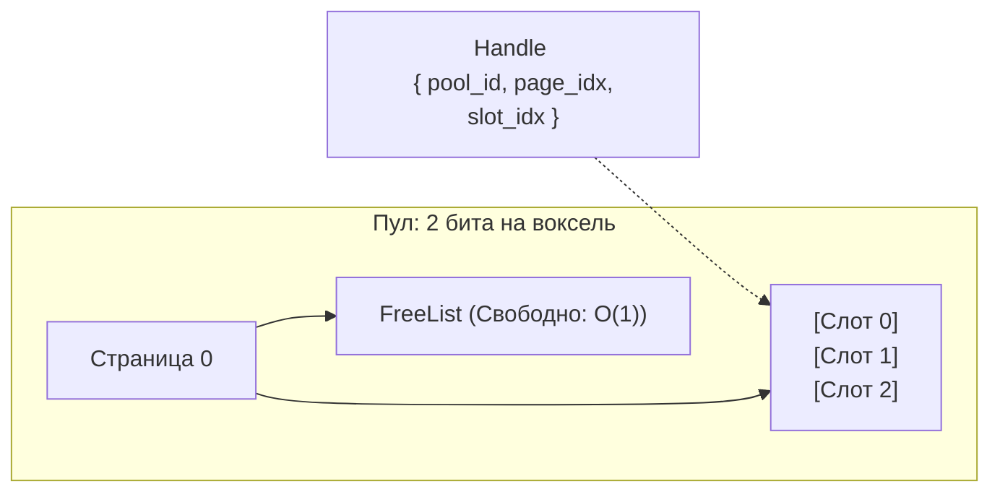

Глобальный менеджер памяти исключает вызовы `new/malloc` во время игры, нарезая память на страницы с фиксированными слотами (`alignas(64)`).

---
## Устройство пулов

---
## Правила управления
* Массивы вокселей внутри пулов хранятся в запакованном виде (Bit-Packing). Наш C++ код сдвигает биты напрямую внутри слотов.
* Поиск свободных мест осуществляется через `FreeList` за $O(1)$.
* Если страница полностью пустеет, она деаллоцируется, чтобы избежать утечек.

*Связанные заметки:* [[Принципы управления памятью (Chunk Memory)]], [[Класс-мост VoxelWorld (GDExtension)]].